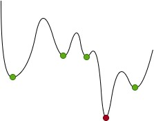

# Backpropagation continued

THIS PART OF THE SERIES IS STILL 🚧UNDER CONSTRUCTION🚧

This section explores a few of the problems (and solutions) to neural networks and backpropagation. 

We will polish our previous network model by applying a few new techniques and optimizations to speed up and stabilize the learning process. 

## This is part 3 of a series of github repos on neural networks

- [part 1 - simplest network](https://github.com/gokadin/ai-simplest-network)
- [part 2 - backpropagation](https://github.com/gokadin/ai-backpropagation)
- part 3 - backpropagation-continued (**you are here**)

## Table of Contents

- [Theory](#theory)

  - [Local and global minima](#local-and-global-minima)

  - [Over fitting and generalization](#over-fitting-and-generalization)

  - [The vanishing gradient problem](#the-vanishing-gradient-problem)

  - [More activation functions](#more-activation-functions)
  - [Sigmoid](#sigmoid)
    - [Tanh](#tanh)
    - [ReLU](#relu)
    - [Leaky ReLU](#leaky-relu)
    - [Softmax](#softmax)

  - [More error functions](#more-error-functions)

    - [Cross entropy](#cross-entropy)

  - [Different types of gradient descent](#different-types-of-gradient-descent)

    - [Batch gradient descent](#batch-gradient-descent)
    - [Stochastic gradient descent](#stochastic-gradient-descent)
    - [Mini-batch gradient descent](#mini-batch-gradient-descent)

  - [Optimization techniques](#optimization-techniques)
  - [Momentum](#momentum)
    - [Adam](#adam)

  - [Better weight initialization](#better-weight-initialization)
- [Code example](#code-example)
- [References](#references)

## Theory

### Local and global minima

The error function will usually have many local minima (green dots) in addition to its global minimum (red dot). The more shallow a local minimum is, the least optimized is the solution. 

Gradient descent will always go towards the nearest minimum which will almost always be a local one. However, since error functions have high dimentionality (proportional to the number of weights), its local minima are very deep, if not almost as deep as the global one. 

### Over fitting and generalization

🚧UNDER CONSTRUCTION🚧

### The vanishing gradient problem

In a network with many hidden layers, the vanishing gradient problem is when the the gradient becomes extremely small the further back it goes towards the input layer. 

Consider the derivative of a non-linear activation function:

 approaches zero when  is close to either zero or one. This is then multipled within the chain rule of the gradient calculation and the more layers with non-linear activation functions it passes through, the more the gradient becomes closer to zero. 

This effectively means that layers closer to the output layer do most of the learning. 

The other extreme of this problem is the *exploding* gradient. This is when the gradient becomes extremely large, usually occuring in temporal backpropagation networks. 

### More activation functions

#### Sigmoid

As seen in the vanishing gradient section, the sigmoid function we've been using so far tends to kill the gradient when its output is close to zero or one. 

Another drawback of the sigmoid is that its not zero-centered, meaning its output is always positive. This makes the gradient either all positive or all negative, introducing zig-zagging dynamic in weight updates. 

Because of these issues, sigmoid is not recommended to be used anymore. Let's explore some of the other functions instead. 

#### Tanh

Tanh is similar to the sigmoid function, except that it outpus in a range of , making it zero-centered. However just like the sigmoid it also causes the vanishing gradient problem. 

#### ReLU

ReLU or rectified linear unit is the most commonly used function in today's neural networks for hidden layers and was found to greatly accelerate convergence compare to sigmoid and tanh. 

It doesn't diminish the gradient down to almost zero at both extremes like the sigmoid and tanh functions and it's faster to compute since it's just taking the maximum value of zero and . 

However it does have its issues: it's also not zero-centered and the gradients for negative inputs are zero. This can kill a node, since weights are not updated, sometimes causing a node to never fire again. 

#### Leaky ReLU

Leaky ReLU tries to fix the killing tendencies of ReLU by introducing a small negative slope when . It doesn't always correct the problem, but it's worth giving it a try if you find that too many nodes are dying in your network. 

Parametric ReLU is a version of leaky ReLU where the value  is replaced by a learnable parameter. 

#### Softmax

Softmax is special in the sense that it needs all of the nodes of the layer to compute the output of each node. 

where  is the input of the node being activated and  is the input of every node in the same layer. 

The function always outputs a number in the range , representing a *probability distribution*. This means that the sum of the outpus of each node of a layer will always be equal to . In other words, softmax transforms any input vector of arbitrarily large or small numbers into a probability distribution. 

This is why it's often used on the output layer, where we need to classify our data into categories. 

### More error functions

#### Cross entropy

##### What is entropy?

Entropy is the average bits of transmitted information where one bit reduces our uncertainty of a situation by a factor of two. 

To be more concrete, let's illustrate it with a few examples. Say there is a match of soccer between two teams that have an equal chance of winning (50% each). If someone tells us that team 1 will win, they will have transmitted 1 bit of information to us. 

If there are 4 teams instead that are equally likely to win and someone tells us that team 1 will win, then they would have transmitted 2 bits of information because they would have reduced our uncertainty by a factor of 4 (). Therefore, we can calculate the number of bits transmitted by computing the base two log of 4 (). 

Now let's say that we have two teams again, but team 1 has a 75% chance of winning and team 2 has a 25% chance. If we are told that team 2 will win, then the transmitted information is  bits. The uncertainty reduction is the inverse of the event's probability. Similarily, if we are told that team 1 will win, then we are given  bits. If we sum these numbers it will give us the average transmitted bits:  bits. This is called entropy and its general equation is:

...

### Different types of gradient descent

#### Batch gradient descent

This is essentially what we've been doing in *part 1* and *part 2* of this series. We only update the network weights once all of the training associations have gone trough. 

One cycle through all of the associations is called an **epoch** and batch gradient descent updates the weights at the end of each epoch. 

This has the advantage of updating the weights less frequently, making it more efficient, but it risks converging too soon to a less optimal function minimum. 

#### Stochastic gradient descent

Stochastic gradient descent is the opposite. Instead of updating the weights once at the end of each epoch, it updates them for each association. 

This obviously makes it slower to run since we have more operations per training association. It can avoid the premature convergence problem of batch gradient descent since the variance over training epochs is higher, however this can equally make it harder for the network to converge towards a minimum. 

The *stochastic* part means that it shuffles the dataset at the beginning of each epoch. 

#### Mini-batch gradient descent

Mini-batch takes advantage of the strenghts of both methods by splitting the dataset into small batches and updating the weights after each batch is processed. 

Note that stochastic gradient descent is often used to mean mini-batch. In fact, the only difference between the two is the number of associations between weight updates. Mini-batch equally shuffles the dataset at the beginning of each epoch and then partitions the data into batches. 

In the image above the dataset was split into mini batches of 2 associations each. A good batch size can be anything and is one of the parameters that needs to be frequentely tuned for optimal results. Keep in mind that larger batch sizes should compute faster. 

### Optimization techniques

#### Momentum

Gradient descent is a rather dumb and shortsighted algorithm because it essentially just goes in the direction of the *current* sample of inputs, not being aware of anything else. But the current direction may not be optimal, given the curvature of the function. Gradient descent may end up traversing long shallow planes as well as steep cliffs, using the same learning rate for all terrains of the function. 

This is where momentum comes in. The momentum algorithm takes into consideration the previous gradients and influences the learning rate based on the topology of the function. If the recent gradients are all well aligned in the same direction, then the learning rate will be larger, otherwise it will be smaller. 

Recall the formula for updating weights: 

We are going to introduce the momentum parameter  and the current velocity  to the equation:

Therefore the first velocity value will be: 

The second one will take into account the first one: 

The third one will use the second one and so on: 

#### Adam

Adam is derived from *adaptive momentum estimation* and unlike the momentum described above, it calculates a custom learning rate for each parameter. 

This is accomplished by calculating two different moving averages over the gradient. The first one is the mean and the second one is the uncentered variance. We do this by introducing two new hyperparameters (beta1 and beta2):

where  is the gradient . 
The beta parameters are normally assigned values  and  respectively and are almost *never* changed. 

The only problem is, we need to perform bias correction since initially  and  are each a vector of zeros. 

And finally we use the moving averages to compute an individual learning rate for each parameter:

 being the a very small value to avoid division by zero, normally assigned . 

There are several other optimization functions, however Adam is one the most widely used and successful. 

Find the implementation in `backpropagation.go`. 

### Better weight initialization

So far we've initialized the weights as Gaussian random variables with a mean of 0 and standard deviation of 1, but we can do better than that. 

One issue with this approach is that it can cause the vanishing gradient problem. Imagine that you have 1000 input nodes all connecting to a node  in the next hidden layer. If half of the inputs are 0 and half are 1, then the weighted sum  of node  is also a Gaussian distribution with mean 0 and standard deviation . 

This means that  will often be either very large or very small. Once node  is activated, it's output from a sigmoid function for example will be very close to either 1 or 0. And as we've seen before, this is the recipe for the vanishing gradient problem. 

To avoid this, we can initialize the weights of a certain layer as Gaussian random variables with mean 0 and standard deviation  where  represents the number of nodes in the layer. Now if we repeat the experiment and have 500 inputs as 0 and 500 inputs as 1, the weighted sum of node  will have a Gaussian distribution with mean 0, but a standard deviation of  and this will avoid activating the node near it's extremes. 

Although this is relevent for weights, biases on the other hand don't benefit much from this and we can continue initializing them to zero, letting gradient descent tune them. 

Find the implementation in `layer.go`. 

## Code example

🚧UNDER CONSTRUCTION🚧

## References

- Artificial intelligence engines by James V Stone (2019)
- Complete guide on deep learning: http://neuralnetworksanddeeplearning.com/chap2.html
- Activation functions: https://medium.com/@prateekvishnu/activation-functions-in-neural-networks-bf5c542d5fec
- Mini-batch gradient descent: https://machinelearningmastery.com/gentle-introduction-mini-batch-gradient-descent-configure-batch-size/
- Batch normalization: https://towardsdatascience.com/batch-normalization-in-neural-networks-1ac91516821c
- Momentum: https://gluon.mxnet.io/chapter06_optimization/momentum-scratch.html
- Adam: https://towardsdatascience.com/adam-latest-trends-in-deep-learning-optimization-6be9a291375c