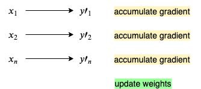

# Backpropagation continued

THIS PART OF THE SERIES IS STILL 🚧UNDER CONSTRUCTION🚧

This section explores a few of the problems (and solutions) to neural networks and backpropagation. 

We will polish our previous network model by applying a few new techniques and optimizations to speed up and stabilize the learning process. 

## This is part 3 of a series of github repos on neural networks

- [part 1 - simplest network](https://github.com/gokadin/ai-simplest-network)
- [part 2 - backpropagation](https://github.com/gokadin/ai-backpropagation)
- part 3 - backpropagation-continued (**you are here**)
- [part 4 - hopfield networks](https://github.com/gokadin/ai-hopfield-networks)

## Table of Contents

- [Theory](#theory)
  - [Local and global minima](#local-and-global-minima)
  - [Over fitting and generalization](#over-fitting-and-generalization)
  - [The vanishing gradient problem](#the-vanishing-gradient-problem)
  - [More activation functions](#more-activation-functions)
    - [Sigmoid](#sigmoid)
    - [Tanh](#tanh)
    - [ReLU](#relu)
    - [Leaky ReLU](#leaky-relu)
    - [Softmax](#softmax)
  - [More error functions](#more-error-functions)
    - [Cross entropy](#cross-entropy)
  - [Different types of gradient descent](#different-types-of-gradient-descent)
    - [Batch gradient descent](#batch-gradient-descent)
    - [Stochastic gradient descent](#stochastic-gradient-descent)
    - [Mini-batch gradient descent](#mini-batch-gradient-descent)
  - [Optimization techniques](#optimization-techniques)
    - [Batch normalization](#batch-normalization)
    - [Momentum](#momentum)
    - [Adam](#adam)
  - [Better weight initialization](#better-weight-initialization)
- [Code example](#code-example)
- [References](#references)

## Theory

### Local and global minima

The error function will usually have many local minima (green dots) in addition to its global minimum (red dot). The more shallow a local minimum is, the least optimized is the solution. 

Gradient descent will always go towards the nearest minimum which will almost always be a local one. However, since error functions have high dimentionality (proportional to the number of weights), its local minima are very deep, if not almost as deep as the global one. 

### Over fitting and generalization

🚧UNDER CONSTRUCTION🚧

### The vanishing gradient problem

In a network with many hidden layers, the vanishing gradient problem is when the the gradient becomes extremely small the further back it goes towards the input layer. 

Consider the derivative of a non-linear activation function:

$$ f\prime(x) = f(x)(1 - f(x)) $$

$f\prime(x)$ approaches zero when $f(x)$ is close to either zero or one. This is then multipled within the chain rule of the gradient calculation and the more layers with non-linear activation functions it passes through, the more the gradient becomes closer to zero. 

This effectively means that layers closer to the output layer do most of the learning. 

The other extreme of this problem is the *exploding* gradient. This is when the gradient becomes extremely large, usually occuring in temporal backpropagation networks. 

### More activation functions

#### Sigmoid

$$ f(x) = \frac{1}{1 + e^{-x}} \quad \quad f\prime(x) = f(x)(1 - f(x)) $$

As seen in the vanishing gradient section, the sigmoid function we've been using so far tends to kill the gradient when its output is close to zero or one. 

Another drawback of the sigmoid is that its not zero-centered, meaning its output is always positive. This makes the gradient either all positive or all negative, introducing zig-zagging dynamic in weight updates. 

Because of these issues, sigmoid is not recommended to be used anymore. Let's explore some of the other functions instead. 

#### Tanh

$$ f(x) = \frac{2}{1 + e^{-2x}} -1  \quad \quad f\prime(x) = 1 - f(x)^2 $$

Tanh is similar to the sigmoid function, except that it outpus in a range of $[-1, 1]$, making it zero-centered. However just like the sigmoid it also causes the vanishing gradient problem. 

#### ReLU

$$ f(x) = \begin{cases} 0 & \mbox{for } x < 0 \\ x & \mbox{for } x \geq 0 \end{cases} \quad \quad f\prime(x) = \begin{cases} 0 & \mbox{for } x < 0 \\ 1 & \mbox{for } x \geq 0 \end{cases} $$

ReLU or rectified linear unit is the most commonly used function in today's neural networks for hidden layers and was found to greatly accelerate convergence compare to sigmoid and tanh. 

It doesn't diminish the gradient down to almost zero at both extremes like the sigmoid and tanh functions and it's faster to compute since it's just taking the maximum value of zero and $x$. 

However it does have its issues: it's also not zero-centered and the gradients for negative inputs are zero. This can kill a node, since weights are not updated, sometimes causing a node to never fire again. 

#### Leaky ReLU

$$ f(x) = \begin{cases} 0.01x & \mbox{for } x < 0 \\ x & \mbox{for } x \geq 0 \end{cases} \quad \quad f\prime(x) = \begin{cases} 0.01 & \mbox{for } x < 0 \\ 1 & \mbox{for } x \geq 0 \end{cases} $$

Leaky ReLU tries to fix the killing tendencies of ReLU by introducing a small negative slope when $x < 0$. It doesn't always correct the problem, but it's worth giving it a try if you find that too many nodes are dying in your network. 

Parametric ReLU is a version of leaky ReLU where the value $0.01$ is replaced by a learnable parameter. 

#### Softmax

Softmax is special in the sense that it needs all of the nodes of the layer to compute the output of each node. 

$$ f(x_a) = \frac{e^{x_a}}{\sum^b_{b=1} e^{x_b}} \quad \quad f\prime(x_a) = f(x_a)(1 - f(x_a)) $$

where $x_a$ is the input of the node being activated and $x_b$ is the input of every node in the same layer. 

The function always outputs a number in the range $[0, 1]$, representing a *probability distribution*. This means that the sum of the outpus of each node of a layer will always be equal to $1$. In other words, softmax transforms any input vector of arbitrarily large or small numbers into a probability distribution. 

This is why it's often used on the output layer, when we need to classify our data into categories. 

### More error functions

#### Cross entropy

##### What is entropy?

Entropy is the average bits of transmitted information where one bit reduces our uncertainty of a situation by a factor of two. 

To be more concrete, let's illustrate it with a few examples. Say there is a match of soccer between two teams that have an equal chance of winning (50% each). If someone tells us that team 1 will win, they will have transmitted 1 bit of information to us. 

If there are 4 teams instead that are equally likely to win and someone tells us that team 1 will win, then they would have transmitted 2 bits of information because they would have reduced our uncertainty by a factor of 4 ($2^2 = 4$). Therefore, we can calculate the number of bits transmitted by computing the base two log of 4 ($log_2(4) = 2$). 

Now let's say that we have two teams again, but team 1 has a 75% chance of winning and team 2 has a 25% chance. If we are told that team 2 will win, then the transmitted information is $-log_2(0.25) = 2$ bits. The uncertainty reduction is the inverse of the event's probability. Similarily, if we are told that team 1 will win, then we are given $-log_2(0.75) = 0.41$ bits. If we sum these numbers it will give us the average transmitted bits: $2 * 0.25 + 0.41 * 0.75 = 0.81$ bits. This is called entropy and its general equation is:

$$ H(p) = -\sum_ip_ilog_2(p_i) $$

...

$$ E = - \sum^J_{j=1} t_j log y_j $$

$$ \frac{\partial E}{\partial x_i} = \sum^J_{j=1} \frac{\partial C}{\partial y_j} \frac{\partial y_i}{\partial x_i} = y_i - t_i $$

### Different types of gradient descent

#### Batch gradient descent

This is essentially what we've been doing in *part 1* and *part 2* of this series. We only update the network weights once all of the training associations have gone trough. 

One cycle through all of the associations is called an **epoch** and batch gradient descent updates the weights at the end of each epoch. 

This has the advantage of updating the weights less frequently, making it more efficient, but it risks converging too soon to a less optimal function minimum. 

#### Stochastic gradient descent

Stochastic gradient descent is the opposite. Instead of updating the weights once at the end of each epoch, it updates them for each association. 

This obviously makes it slower to run since we have more operations per training association. It can avoid the premature convergence problem of batch gradient descent since the variance over training epochs is higher, however this can equally make it harder for the network to converge towards a minimum. 

The *stochastic* part means that it shuffles the dataset at the beginning of each epoch. 

#### Mini-batch gradient descent

Mini-batch takes advantage of the strenghts of both methods by splitting the dataset into small batches and updating the weights after each batch is processed. 

Note that stochastic gradient descent is often used to mean mini-batch. In fact, the only difference between the two is the number of associations between weight updates. Mini-batch equally shuffles the dataset at the beginning of each epoch and then partitions the data into batches. 

In the image above the dataset was split into mini batches of 2 associations each. A good batch size can be anything and is one of the parameters that needs to be frequentely tuned for optimal results. Keep in mind that larger batch sizes should compute faster. 

### Optimization techniques

#### Batch normalization

One technique used to reduce the vanishing gradient problem is to normalize the hidden layer outputs just as we normalize inputs before feeding them to the network. Example, if the input values are from 0 to 255, we can normalize them to be between 0 and 1. If we don't normalize the inputs, high values can destabilize the network and lead to the exploding gradient problem as well as slow the training speed substantially. 

This technique makes sure that the hidden layer activations don't go to the extremes (say 0 and 1), so that they don't diminish the gradient too much for the following layers. 

A normalized value $z$ is achieved by subtracting the mean $m$ and dividing by the standard deviation $s$: $z = \frac{y - m}{s} $

We then transform $z$ with two new trainable parameters $g$ and $b$: $(z * g) + b$

🚧UNDER CONSTRUCTION🚧

#### Momentum

Gradient descent is a rather dumb and shortsighted algorithm because it essentially just goes in the direction of the *current* sample of inputs, not being aware of anything else. But the current direction may not be optimal, given the curvature of the function. Gradient descent may end up traversing long shallow planes as well as steep cliffs, using the same learning rate for all terrains of the function. 

This is where momentum comes in. The momentum algorithm takes into consideration the previous gradients and influences the learning rate based on the topology of the function. If the recent gradients are all well aligned in the same direction, then the learning rate will be larger, otherwise it will be smaller. 

Recall the formula for updating weights: $w = w - \epsilon \nabla \frac{\partial E}{\partial w}$

We are going to introduce the momentum parameter $\gamma$ and the current velocity $v$ to the equation:

$$ v = \gamma v + \epsilon \nabla \frac{\partial E}{\partial w} $$

Therefore the first velocity value will be: $v_1 = \epsilon \nabla \frac{\partial E}{\partial w}$

The second one will take into account the first one: $v_2 = \gamma v_1 + \epsilon \nabla \frac{\partial E}{\partial w}$

The third one will use the second one and so on: $v_3 = \gamma v_2 + \epsilon \nabla \frac{\partial E}{\partial w}$

#### Adam

🚧UNDER CONSTRUCTION🚧

Adam is derived from *adaptive momentum estimation* and it essentially calculates a custom learning rate for each parameter. 

### Better weight initialization

🚧UNDER CONSTRUCTION🚧

## Code example

🚧UNDER CONSTRUCTION🚧

## References

- Artificial intelligence engines by James V Stone (2019)
- Complete guide on deep learning: http://neuralnetworksanddeeplearning.com/chap2.html
- Activation functions: https://medium.com/@prateekvishnu/activation-functions-in-neural-networks-bf5c542d5fec
- Mini-batch gradient descent: https://machinelearningmastery.com/gentle-introduction-mini-batch-gradient-descent-configure-batch-size/
- Batch normalization: https://towardsdatascience.com/batch-normalization-in-neural-networks-1ac91516821c
- Momentum: https://gluon.mxnet.io/chapter06_optimization/momentum-scratch.html
- Adam: https://machinelearningmastery.com/adam-optimization-algorithm-for-deep-learning/ and https://towardsdatascience.com/adam-latest-trends-in-deep-learning-optimization-6be9a291375c